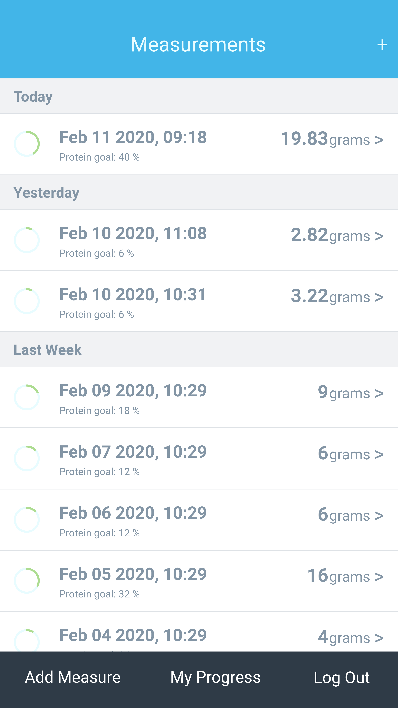

# Final Capstone Project: Tracking Daily Food Intake App

> This app is a mobile web app which helps you to track the daily food intake that you should eat. This project is based on a tracking app.

  

  

## Built With

- Rails API 5.2.4.1
- Postgresql
- React
- HTML
- Bootstrap
- CSS

## Live Demo

Open the app in Mobile screen
[Live Demo Link](https://fast-shelf-63763.herokuapp.com/)

## Installation

In this repository are the back-end and frontend which were created with the webpack=react flag that Rails offers.

1. Clone the project to your local directory

```
 git clone https://github.com/jstiven01/daily-food-intake-app.git
```

2. Get in to the folder app

```
cd daily-food-intake
```
3. Prepare rails environment

```
bundle install --without production
rails db:migrate
```

4. run rails server

```
rails s
```

5. Go to Localhost in your favorite browser

```
http://localhost:3000/
```

### Run tests

```
rspec
```

## Author

👤 **Johan Stiven Tinjacá Tocora**

- Github: [@jstiven01](https://github.com/jstiven01)
- Twitter: [@TinjacaJohan](https://twitter.com/TinjacaJohan)
- Linkedin: [Johan Tinjacá](https://www.linkedin.com/in/johanstiventinjaca/)

## Credits

All the design info (color, typography, layouts) was based on the the [Bodytrack.it - An iOs app - Branding, UX and UI](https://www.behance.net/gallery/13271423/Bodytrackit-An-iOs-app-Branding-UX-and-UI) Design idea by Gregoire Vella is licensed under [CC BY 2.0](https://creativecommons.org/licenses/by/2.0/)

## 📝 License

This project is [MIT](lic.url) licensed.
